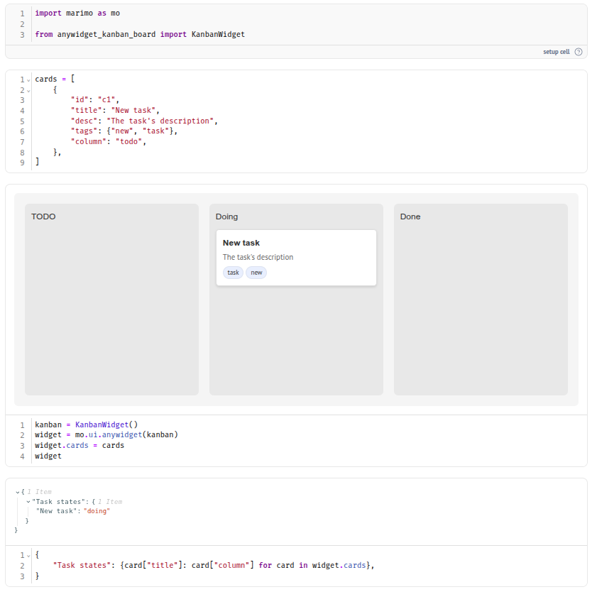

# Anywidget Kanban Board

A basic implementation of a kanban board widget.

See a usage example for marimo in [example/kanban_widget_mo.py](https://github.com/insolor/anywidget-kanban-board/blob/main/example/kanban_widget_mo.py).

Installation:

```shell
pip install anywidget-kanban-board
```

or

```shell
uv add anywidget-kanban-board
```

or

```shell
poetry add anywidget-kanban-board
```

Screenshot of the widget in marimo notebook:


